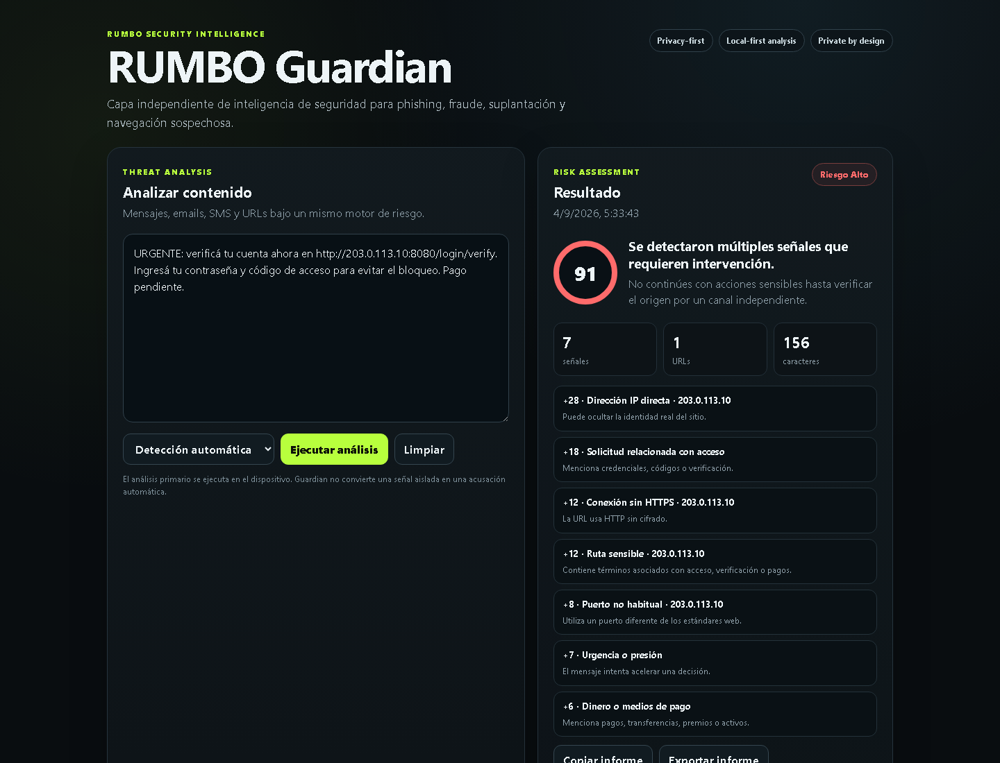

# RUMBO Guardian

**RUMBO Security Intelligence** · v0.4.0

RUMBO Guardian is an independent security intelligence layer for detecting and explaining signals associated with phishing, fraud, impersonation and suspicious navigation.

It follows a **privacy-first, local-first** architecture: technical analysis runs on the operator's device, evidence remains inspectable, and contextual trust decisions never erase underlying technical indicators.

**Portfolio demo:** https://fscfede-beep.github.io/rumbo-guardian/

## Core capabilities

- Explainable 0–100 risk scoring for messages and URLs.
- Detection of urgency, credential requests, payment signals and suspicious domains.
- Local trusted / blocked domain context.
- Tamper-evident Evidence Ledger with SHA-256 hash chaining, local integrity verification and JSON export.
- Individual risk-report export.
- Installable PWA for desktop use.
- Brave / Chrome extension for explicit, on-demand inspection of the active tab.
- Ranking of visible links by risk.
- High-risk local alerts.

## Architecture
The shared risk engine is separated from the operator-facing web UI and browser extension. Trusted-domain context changes operator context, not the technical evidence: a trusted entry does not automatically convert a technically suspicious signal into a safe result.

## Run locally

On Windows, run `START_GUARDIAN.cmd` and open `http://127.0.0.1:8766/`.

The application can also be served with the included Node.js local server.

## Browser extension

1. Open `brave://extensions` or `chrome://extensions`.
2. Enable Developer mode.
3. Choose **Load unpacked**.
4. Select the `extension` directory.
5. Open Guardian from a normal web page and choose **Analizar esta pestaña**.

The extension requests only `activeTab`, `scripting` and `storage` permissions. Page inspection is initiated explicitly by the operator.

## Verification

The repository includes repeatable unit, portability, portfolio, real-browser extension and real-browser Evidence Ledger integrity tests. The integration harness uses an isolated Brave profile and a controlled high-risk fixture.

Run `npm run check` and `npm test`. On Windows, `tests/run-extension-integration.ps1` exercises the extension and `tests/run-ledger-browser-integration.ps1` verifies ledger integrity and tamper detection in isolated Brave sessions.

The portfolio screenshot is reproducible with `scripts/capture-portfolio.ps1` and uses synthetic test data only.

See `EVIDENCE.md` for the verified baseline and `SECURITY.md` for security boundaries.

## Product documentation
- `PRODUCT.md` — product principles and scope.
- `PORTFOLIO.md` — portfolio narrative and demonstrated engineering capabilities.
- `SECURITY.md` — defensive scope and security boundaries.
- `EVIDENCE.md` — verification evidence and reproducibility notes.

## Licensing status

This portfolio release does not grant an open-source license. Source is published for evaluation and demonstration; all rights remain reserved unless a later release states otherwise.

